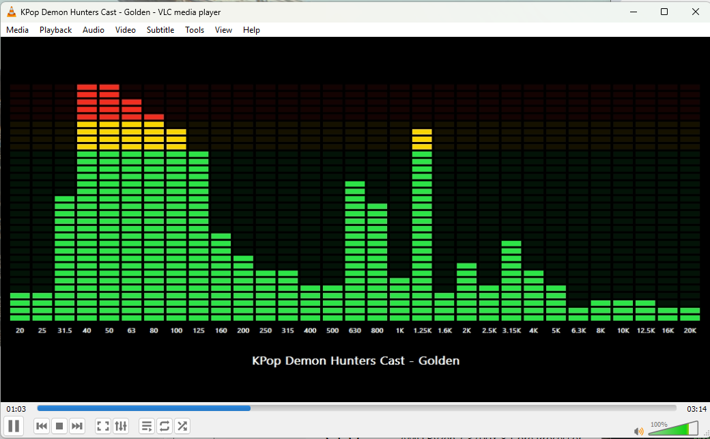
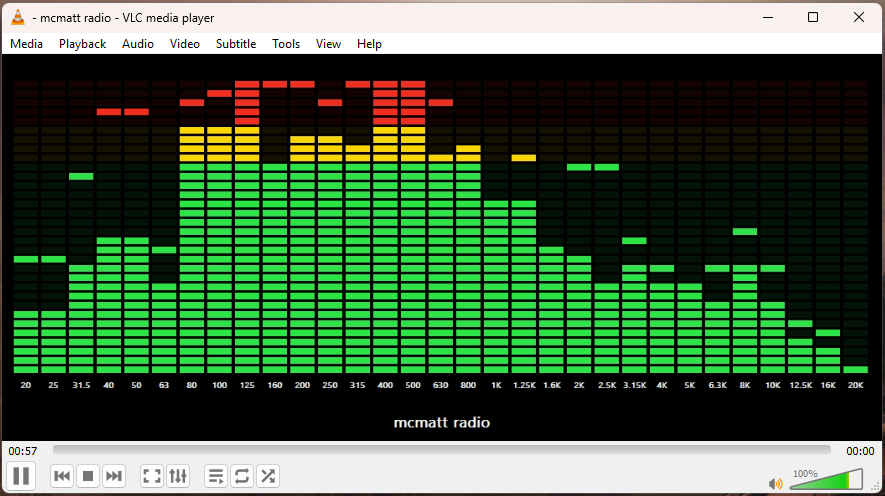

# VLC Visualizations

A small collection of native VLC visualization plugins for Windows.

Spectrum Info:


LED Segments:



LED Peaks:



Breakout Chill:


Breakout Advanced:


This scaffold targets VLC 3.x on Windows. It uses VLC's visualization/audio-filter plugin API for audio samples and VLC's video-output request API for rendering, matching the built-in Spectrum visualizer's placement inside the VLC window.

Your current VLC path is assumed to be:

```text
C:\Program Files\VideoLAN\VLC
```

That means you need 64-bit Windows builds of these plugins. See [docs/WINDOWS.md](docs/WINDOWS.md) for the Windows-specific build flow.

## Visualizers

- `spectrum_info`: Spectrum-style frequency bars derived from the current audio buffer, with persistent current track/stream text.
- `led_segments`: 31-band LED-segment visualization with frequency labels, current track/stream text, and green, yellow, and red level sections.
- `led_peaks`: 31-band LED-segment visualization with hardware-style peak hold indicators that pause briefly, then fall slowly.
- `breakout_chill`: Breakout-inspired visualization with frequency-reactive bricks, an auto-playing paddle, and a relaxed game feel.
- `breakout_advanced`: Breakout-inspired visualization with song-long brick breaking, score, player HUD, and a smaller arcade-style square ball.

`breakout_advanced` treats the brick wall like part of the music display. A brick only breaks when the ball hits it while that brick is active from the current frequency signal. Each broken brick is worth one point. Broken bricks stay gone for the current song, then the wall and score reset when the track changes. If stream metadata does not change, the wall also resets after a short silence gap between songs.

## Prerequisites

- VLC 3.x development headers and plugin import libraries.
- CMake 3.20 or newer.
- A 64-bit Windows C compiler for your installed VLC, preferably MSYS2 MinGW64.
- `pkg-config` metadata for `vlc-plugin`, or equivalent include/library paths supplied manually.

On many systems, VLC runtime installers do not include the headers needed to build plugins. If `pkg-config --cflags vlc-plugin` fails, install or build the VLC SDK/development package first.

## Download Prebuilt DLLs

Prebuilt Windows x64 DLLs are available from the [GitHub Releases page](https://github.com/matt448/vlc-visualizations/releases).

1. Open the latest release.
2. Download the `*-win64.dll` files from the release assets.
3. Rename them to remove the release suffix. For example, `libtrackinfo_visualizer_plugin-v0.1.0-win64.dll` becomes `libtrackinfo_visualizer_plugin.dll`.
4. From an Administrator PowerShell, copy the DLLs into VLC's application plugin folder:

```text
C:\Program Files\VideoLAN\VLC\plugins\visualization\
```

Refresh VLC's plugin cache:

```powershell
& "C:\Program Files\VideoLAN\VLC\vlc-cache-gen.exe" "C:\Program Files\VideoLAN\VLC\plugins"
```

Then launch VLC with one of the visualization shortcuts.

## Build

```powershell
cmake -S . -B build -DVLC_TARGET_BITS=64
cmake --build build
```

The output plugin DLLs are named:

```text
libtrackinfo_visualizer_plugin.dll
libled_segment_visualizer_plugin.dll
libled_peak_visualizer_plugin.dll
libbreakout_chill_visualizer_plugin.dll
libbreakout_advanced_visualizer_plugin.dll
```

## Install

Install the DLLs into VLC's application plugin folder and refresh VLC's plugin cache:

```text
C:\Program Files\VideoLAN\VLC\plugins\visualization\
```

```powershell
Copy-Item ".\build\libtrackinfo_visualizer_plugin.dll" "C:\Program Files\VideoLAN\VLC\plugins\visualization\" -Force
Copy-Item ".\build\libled_segment_visualizer_plugin.dll" "C:\Program Files\VideoLAN\VLC\plugins\visualization\" -Force
Copy-Item ".\build\libled_peak_visualizer_plugin.dll" "C:\Program Files\VideoLAN\VLC\plugins\visualization\" -Force
Copy-Item ".\build\libbreakout_chill_visualizer_plugin.dll" "C:\Program Files\VideoLAN\VLC\plugins\visualization\" -Force
Copy-Item ".\build\libbreakout_advanced_visualizer_plugin.dll" "C:\Program Files\VideoLAN\VLC\plugins\visualization\" -Force
& "C:\Program Files\VideoLAN\VLC\vlc-cache-gen.exe" "C:\Program Files\VideoLAN\VLC\plugins"
```

Run those install commands from an Administrator PowerShell.

Use a visualization from the command line with `--audio-visual=<shortcut>`.

## Run

Spectrum Info:

```powershell
& "C:\Program Files\VideoLAN\VLC\vlc.exe" --audio-visual=spectrum_info path\to\song.mp3
```

LED Segments:

```powershell
& "C:\Program Files\VideoLAN\VLC\vlc.exe" --audio-visual=led_segments path\to\song.mp3
```

LED Peaks:

```powershell
& "C:\Program Files\VideoLAN\VLC\vlc.exe" --audio-visual=led_peaks path\to\song.mp3
```

Breakout Chill:

```powershell
& "C:\Program Files\VideoLAN\VLC\vlc.exe" --audio-visual=breakout_chill path\to\song.mp3
```

Breakout Advanced:

```powershell
& "C:\Program Files\VideoLAN\VLC\vlc.exe" --audio-visual=breakout_advanced path\to\song.mp3
```

VLC's audio visualization menu is hard-coded and may not show third-party visualization plugins. Use the command-line option above to start playback with these visualizers.

## Notes

VLC's native plugin ABI is version-sensitive. This project is intentionally small so it can be adjusted for the exact VLC SDK you build against. The metadata code is compiled only when `vlc_playlist_legacy.h` is available, which is the normal VLC 3.x route for accessing the current playlist input.

This plugin is inspired by VLC's built-in Spectrum visualization and is licensed under GPL-2.0-or-later.
