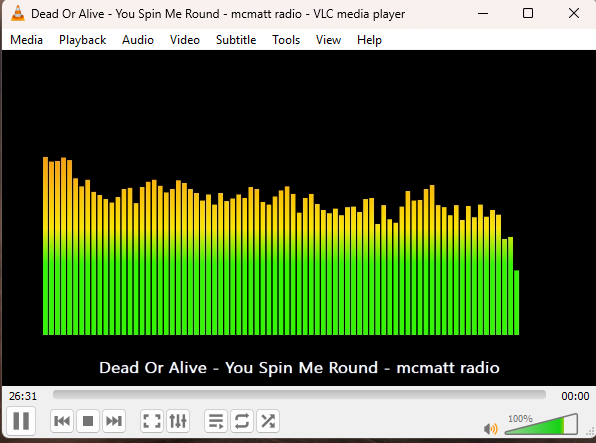

# VLC Visualizations

A small collection of native VLC visualization plugins for Windows.



This scaffold targets VLC 3.x on Windows. It uses VLC's visualization/audio-filter plugin API for audio samples and VLC's video-output request API for rendering, matching the built-in Spectrum visualizer's placement inside the VLC window.

Your current VLC path is assumed to be:

```text
C:\Program Files\VideoLAN\VLC
```

That means you need 64-bit Windows builds of these plugins. See [docs/WINDOWS.md](docs/WINDOWS.md) for the Windows-specific build flow.

## What It Shows

- `spectrum_info`: Spectrum-style frequency bars derived from the current audio buffer, with persistent current track/stream text.
- `led_segments`: 31-band LED-segment visualization with frequency labels and green, yellow, and red level sections.

## Prerequisites

- VLC 3.x development headers and plugin import libraries.
- CMake 3.20 or newer.
- A 64-bit Windows C compiler for your installed VLC, preferably MSYS2 MinGW64.
- `pkg-config` metadata for `vlc-plugin`, or equivalent include/library paths supplied manually.

On many systems, VLC runtime installers do not include the headers needed to build plugins. If `pkg-config --cflags vlc-plugin` fails, install or build the VLC SDK/development package first.

## Download Prebuilt DLLs

Prebuilt Windows x64 DLLs are available from the [GitHub Releases page](https://github.com/matt448/vlc-visualizations/releases).

1. Open the latest release.
2. Download the `*-win64.dll` files from the release assets.
3. Rename them to remove the release suffix. For example, `libtrackinfo_visualizer_plugin-v0.1.0-win64.dll` becomes `libtrackinfo_visualizer_plugin.dll`.
4. Copy the DLLs into your VLC user plugin folder:

```text
%APPDATA%\vlc\plugins\visualization\
```

Create the `plugins\visualization` folders if they do not exist.

Refresh VLC's plugin cache:

```powershell
& "C:\Program Files\VideoLAN\VLC\vlc.exe" --reset-plugins-cache --intf dummy --dummy-quiet vlc://quit
```

Then launch VLC from the command line with one of the visualization shortcuts.

## Build

```powershell
cmake -S . -B build -DVLC_TARGET_BITS=64
cmake --build build
```

The output plugin DLLs are named:

```text
libtrackinfo_visualizer_plugin.dll
libled_segment_visualizer_plugin.dll
```

## Install

Install the DLLs into your VLC user plugin folder and refresh VLC's plugin cache:

```text
%APPDATA%\vlc\plugins\visualization\
```

```powershell
.\scripts\install-windows.ps1 -BuildDir build -VlcDir "C:\Program Files\VideoLAN\VLC"
```

If VLC does not discover the user plugin folder, copy the built DLL into `C:\Program Files\VideoLAN\VLC\plugins\visualization\` from an Administrator PowerShell and run `vlc-cache-gen.exe`.

Use a visualization from the command line with `--audio-visual=<shortcut>`.

## Run

Spectrum Info:

```powershell
& "C:\Program Files\VideoLAN\VLC\vlc.exe" --audio-visual=spectrum_info path\to\song.mp3
```

LED Segments:

```powershell
& "C:\Program Files\VideoLAN\VLC\vlc.exe" --audio-visual=led_segments path\to\song.mp3
```

VLC's audio visualization menu is hard-coded and may not show third-party visualization plugins. Use the command-line option above to start playback with these visualizers.

## Notes

VLC's native plugin ABI is version-sensitive. This project is intentionally small so it can be adjusted for the exact VLC SDK you build against. The metadata code is compiled only when `vlc_playlist_legacy.h` is available, which is the normal VLC 3.x route for accessing the current playlist input.

This plugin is inspired by VLC's built-in Spectrum visualization and is licensed under GPL-2.0-or-later.
